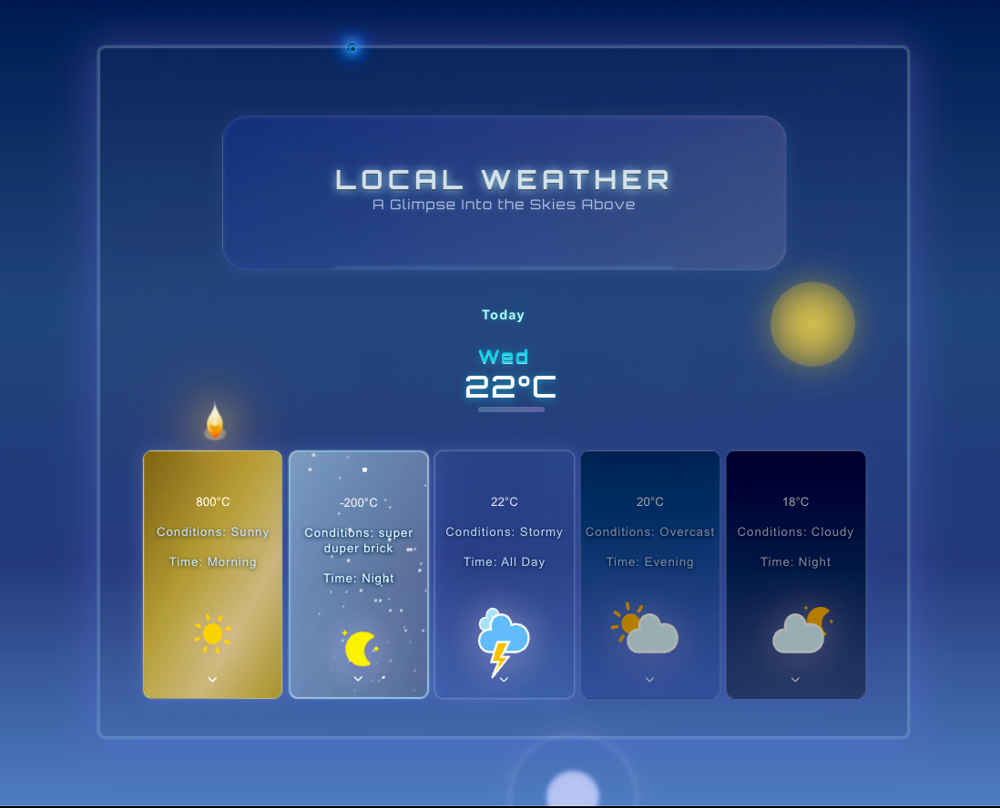
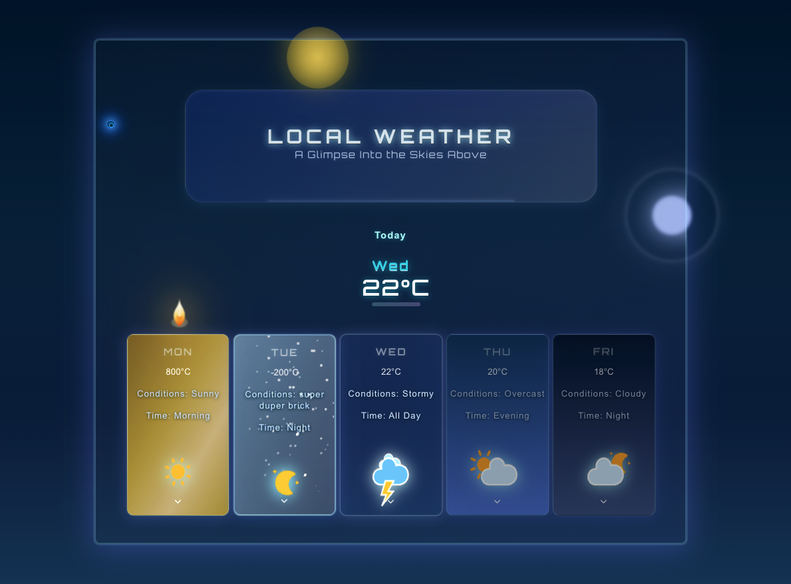

## Visual Demo: Day and Night

Below are screenshots demonstrating the animated day and night states:

**Day:**

**Night:**

## Animated Day/Night Sky

The app’s background features a CSS-animated gradient that smoothly transitions from day to night:

- The background uses a linear gradient and the `skyDayNight` keyframes to animate between lighter (day) and darker (night) tones.
- The sun and moon are absolutely positioned elements that orbit the center of the screen using their own CSS keyframe animations (`sunOrbit` and `moonOrbit`).
- As the gradient brightens, the sun appears and orbits; as it darkens, the sun fades out and the moon fades in, orbiting in a different path.
- This creates a dynamic, immersive sky that transitions smoothly from day to night and back again, with both celestial bodies moving in realistic orbits.

# React Weather App (Vite)

**Description:**
This app is a modern, interactive weather dashboard that displays local weather conditions with animated backgrounds, sun/moon orbits, and dynamic card effects. Each day’s forecast is presented as a visually distinct card, featuring custom effects like flames, snow, and more. The UI is intentionally minimal, with room for future polish and design improvements.

For fun and experimentation, some weather conditions are dramatized with a touch of sarcasm! The project is modular, responsive, and designed for both clarity and visual impact. Built with React and Vite, the codebase is organized for easy extension and customization.

## Project Structure

<pre>
src/
└── components/
		└── WeatherForecast/
				├── WeatherForecast.jsx
				├── WeatherForecast.css
				├── WeatherData/
				│   ├── WeatherData.jsx
				│   └── WeatherData.css
				├── effects/
				│   ├── Flame.jsx
				│   └── SnowParticles.jsx
				├── icons/
				│   └── WeatherIcon.jsx
				└── cursor/
						├── DualRingCursor.jsx
						├── CursorFX.jsx
						└── cursor.css
</pre>

## Organization Philosophy

- **Parent/child/grandchild**: Components are grouped by feature and relationship, not just by type.
- **Effects**: All weather-related visual effects are in the `effects` folder.
- **Icons**: All icon components are in the `icons` folder.
- **Cursor**: All custom cursor logic and styles are in the `cursor` folder.

## How to Run

1. Install dependencies: `npm install`
2. Start the dev server: `npm run dev`

## Customization

You can add new effects, icons, or data displays by creating new components in the appropriate subfolder and importing them where needed.
